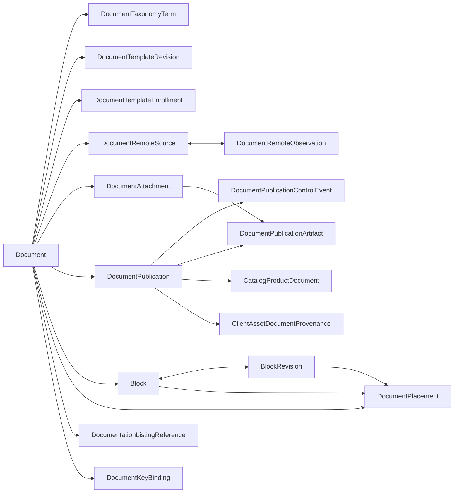

# Document model dependency map

Issue #40. Application version remains 0.8.46. This map is the required
checkpoint before the document models leave `apps.core.models`; it records the
runtime identities that the split must preserve and gives each extraction a
bounded order and verification contract.

> **Version 1 reconciliation (2026-10-02):** completed behavior-preserving
> extractions remain valid, but this sequence no longer authorizes mechanically
> extracting every remaining database-backed document model. ADR 0105 and
> `planning/v1-markdown-content-graph.md` now own the next architecture step.
> Database models retained for workflow, publications, files and migration may
> still be decomposed when a delivery slice needs it; canonical content models
> first migrate behind the repository boundary.

## Compatibility contract

Every extraction keeps all of the following unchanged:

- Django app label `core`, model name, default table name, field definition,
  relation target, reverse relation, ordering, index and constraint name.
- Imports from `apps.core.models`. The root module explicitly re-exports every
  moved model, choice type and upload-key helper under its established name.
- Migration history. Existing migrations continue to resolve models through the
  `core` app registry; no historical migration imports a new implementation
  module.
- API schemas, serializer model bindings, permissions, RLS policy targets,
  recovery data, task imports and runtime behavior.
- Class identity. A name imported from `apps.core.models` and the focused model
  module must resolve to the same class object.

Moving a class must produce `No changes detected` from Django. Any generated
migration, including an option-only migration, is a failed extraction rather
than work to commit.

## Aggregate inventory

The live Django registry reports 15 document-owned database models. The public
model boundary also includes the choice types and helpers used by model fields
and callers.

| Group | Public names | Tables and principal dependencies |
|---|---|---|
| Document identity and review | `Document`, `DocumentCategory`, `DocumentReviewState`, `DocumentTopicType` | `core_document`; depends on tenant, optional organization, entity and account users. |
| Controlled taxonomy selection | `DocumentTaxonomyTerm` | `core_documenttaxonomyterm`; depends on document plus `Taxonomy`, `TaxonomyTerm` and `OrganizationTaxonomyTerm`, which remain in the taxonomy domain. |
| Template rollout | `DocumentTemplateRevision`, `DocumentTemplateEnrollment` | `core_documenttemplaterevision`, `core_documenttemplateenrollment`; revision points to a source document, enrollment joins source and destination documents to an applied revision. |
| Monitored source | `DocumentSourceKind`, `DocumentRemoteSource`, `DocumentRemoteObservation` | `core_documentremotesource`, `core_documentremoteobservation`; the source owns immutable observations and may point back to its last applied observation. |
| Managed files | `DocumentAttachmentPurpose`, `DocumentAttachment`, `document_attachment_upload_to` | `core_documentattachment`; depends on document and entity, with a self-replacing one-to-one chain. |
| Retained publications | `PublicationAudience`, `PublicationRetention`, `PublicationArtifactKind`, `PublicationControlAction`, `DocumentPublication`, `DocumentPublicationControlEvent`, `DocumentPublicationArtifact`, `publication_artifact_upload_to` | `core_documentpublication`, `core_documentpublicationcontrolevent`, `core_documentpublicationartifact`; publications form a supersession chain, events belong to a publication, and artifacts may retain a source attachment. |
| Reusable composition | `BlockKind`, `Block`, `BlockRevision`, `PlacementResolutionMode`, `PlacementAudienceProfile`, `DocumentPlacement` | `core_block`, `core_blockrevision`, `core_documentplacement`; block and revision have a current-revision loop, while placements form a tree and may pin a revision. |
| Library listing | `DocumentationListingReference` | `core_documentationlistingreference`; an organization-owned reference to a document. |
| Stable keys | `DocumentKeyBinding` | `core_documentkeybinding`; depends on document, workspace, entity and the shared binding-name grammar. It is physically separated from the other document declarations in the current monolith. |

`GitExportBundle` and `ImportExternalKey` support documentation workflows but do
not relate to `Document` in the model registry. They remain with integration and
export persistence until those domains receive their own model split.

## Relationship boundaries

The last two models are reverse consumers owned by catalog and asset inventory.
They are not moved with documentation, but their registered reverse names
`catalog_associations` and `client_asset_provenance` are part of the contract.
Every document-owned model also retains its tenant and organization scope links;
entity-backed models retain their one-to-one entity links.

## Runtime consumers

Production code currently imports the root compatibility module broadly. The
highest-use names are `Document` (13 modules), `DocumentPublication` (8),
`DocumentAttachment` and `PublicationAudience` (7 each), `DocumentCategory` and
`DocumentReviewState` (6 each), and `DocumentPlacement`, publication artifacts
and publication events (5 each). Remote-source and template models have only one
to three production consumers and are the lowest-risk starting seams.

Consumers span document handlers and services plus tasks, portal projection,
inventory provenance, notifications, search, imports and Git export. The split
therefore changes implementation imports only after the root compatibility
exports exist. Tests and third-party code may continue importing the established
root names indefinitely.

Historical migrations that create or mutate this aggregate are 0020, 0022,
0026, 0028, 0030, 0063, 0064, 0111, 0113, 0114, 0118 and 0136. Data migrations
use `apps.get_model("core", ...)`; preserving the registered label and model name
keeps them independent of the implementation module.

## Extraction sequence

1. Move monitored-source choices and its two models together. This is a small
   cyclic pair with three direct production consumers and no reverse consumer
   outside the document aggregate.
2. Move template revision and enrollment together. Preserve append-only revision
   behavior and the source/destination document scope checks.
3. Move `DocumentKeyBinding` and its binding grammar dependency. This removes the
   noncontiguous document declaration while preserving the root import.
4. Move attachments with their purpose choice and opaque upload-key helper.
5. Move publications, control events and artifacts together with all four choice
   types and the artifact upload helper. Rehearse portal, inventory provenance,
   retained export and notification paths in the same slice.
6. Move reusable blocks, revisions and placements together. Their mutual current,
   parent and pinned references make partial extraction needlessly fragile.
7. Move taxonomy selection and listing references.
8. Move the `Document` root and its review/category/topic choices after all leaf
   groups refer to it by stable app-qualified relation names. This completes the
   focused module and leaves explicit root re-exports as the compatibility API.

Each focused module uses app-qualified string relation targets where doing so
breaks an import cycle. Shared abstract bases and scoped managers remain
canonical; an extraction must not copy their implementation merely to avoid a
cycle. If the root move exposes a real shared-foundation seam, that foundation is
extracted once before step 8 and verified across every core model.

## Per-slice verification

Before and after each move, capture the affected model label, table, concrete
parent, fields, relation targets, reverse names, constraints and indexes from
Django's app registry. Then verify:

1. focused-module and root-module imports are the same objects;
2. `makemigrations --check --dry-run` reports no changes;
3. Django system checks and the focused domain tests pass;
4. Ruff and MyPy pass for the changed backend boundary;
5. OpenAPI agreement is rerun only when a serializer or handler import boundary
   changes;
6. the local backend starts and reports version 0.8.46.

Publication, attachment and reusable-composition moves also run their retained
evidence, authorization and rollback checks. The final aggregate move runs the
complete document workflow suite and recovery compatibility checks. The full
release gate remains a clean-candidate action after the bounded model sequence,
not a repetition after every file move.
