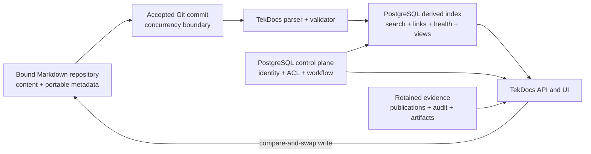

# Markdown-canonical document model investigation

Status: accepted version 1 architecture; delivery sequencing moved to
`planning/v1-markdown-content-graph.md`  
Date: 2026-10-02  
Roadmap slice: version 1 Markdown content graph  
Application baseline: 0.8.46

## Purpose and acceptance criteria

This investigation compares a Markdown-repository system of record with the
current database-first document aggregate. It is complete when it:

1. identifies which current tables can become derived indexes;
2. identifies which tables must remain authoritative application state;
3. identifies which tables can disappear only after an explicit replacement;
4. answers the open questions about links, stable identity, validation,
   indexing, writeback, conflicts and parser choice; and
5. proposes a reversible implementation sequence that preserves current
   authorization, publication, recovery and reusable-content guarantees.

The investigation conclusions were accepted on 2026-10-02. The versioned work,
backlog transfers and implementation gates are maintained in
`planning/v1-markdown-content-graph.md`.

## Recommendation

Adopt the hypothesis in a narrower form:

> Markdown files may become canonical for authored document content and
> portable descriptive metadata. PostgreSQL should remain canonical for the
> security and workflow control plane, immutable evidence, binary custody and
> application state. PostgreSQL should also hold disposable indexes derived
> from the current Git commit.

Do not replace the current aggregate with files in one step. Add the managed
repository, parser and rebuildable index before migrating reads or writes.
Reusable blocks become file-backed Markdown fragments with explicit ordered
inclusion; template enrollment and rollout decisions remain database canonical.

The target authority split is:



The repository binding, not frontmatter, determines tenant and organization
scope. A file must never be able to grant itself a different workspace or
broader access.

## What the current implementation actually stores

The current system is already Markdown-first for authored content, but it is
not file-first:

- `Document` stores document classification, workspace scope and review state.
  Its title is the associated `Entity.display_name`.
- `Block` is stable content identity and `BlockRevision.markdown` is the
  append-only canonical Markdown revision.
- `DocumentPlacement` orders blocks, nests them and selects a live or pinned
  revision. `resolve_document()` materializes a document from that graph.
- normal edits append a block revision using a submitted base revision ID;
  stale edits are rejected as revision conflicts;
- entity links in Markdown use stable `tekdocs://entity/<uuid>` destinations,
  not filename-based links;
- taxonomy selections, document-key bindings, templates, remote-source
  observations, managed files and publications are separate records with
  stronger invariants than Markdown metadata;
- a STATIC publication is an append-only signed snapshot with retained
  Markdown, sanitized HTML, a manifest and artifacts; and
- the existing Git export is a bounded sanitized archive. It is not a
  round-trip canonical working tree.

The public product contract reinforces this structure: documents are ordered
compositions of addressable blocks, live placements follow new revisions,
pinned placements retain an exact revision, remote observations never silently
replace authored content, and STATIC publications remain immutable.

## Table-by-table disposition

The terms in this table mean:

- **File canonical**: authored state lives in a Markdown file; the database row
  is a replaceable projection.
- **Database canonical**: the row remains system-of-record state.
- **Derived**: the row may be rebuilt from a validated repository commit.
- **Conditional**: no removal is safe until the named product decision exists.

| Current model or area | Target disposition | Reason and replacement |
| --- | --- | --- |
| `Document` descriptive fields | File canonical; derived row | `id`, title, category, topic type/version, template marker, collection, tags and content-facing metadata fit frontmatter. Keep a projected row to preserve APIs and joins. |
| `Document.tenant`, `organization`, `entity` scope | Database canonical binding | Repository registration and path policy assign scope. Frontmatter is untrusted input and cannot choose a tenant, client or visibility boundary. The document UUID is copied from the file, but its workspace association is controlled by TekDocs. |
| document ownership and review fields | Database canonical | Owner, reviewer, requests, decisions, due dates and notes refer to users and guarded workflow transitions. Git authorship is useful evidence but is not TekDocs authorization or approval. |
| `Entity` for a document | Derived identity projection | The immutable frontmatter UUID can materialize the document entity. Operational entity rows remain database canonical. Existing UUIDs must be preserved during migration. |
| `Block` | Conditional | A simple file-backed document no longer needs a primary `Block`. Reusable blocks still need stable identity, discoverability and independent ownership. Preserve them until TekDocs either flattens reuse or defines file-backed fragments. |
| `BlockRevision` | Conditional, then Git-derived | Git can replace revision history for file-backed content. It cannot replace current block history while live and pinned placements exist. A pinned reference must identify an immutable Git blob/commit or retained fragment revision before this table can disappear. |
| `DocumentPlacement` | Conditional | It disappears for flattened single-file documents. To preserve composition, replace it with a versioned `composition` manifest that records stable fragment IDs, order, parent, live/pinned mode, audience and pinned Git object. Plain body wikilinks are not an equivalent replacement. |
| `DocumentTaxonomyTerm` | Derived | Store selected stable taxonomy keys in frontmatter and rebuild assignments. `Taxonomy`, `TaxonomyVersion`, `TaxonomyTerm` and `OrganizationTaxonomyTerm` remain database canonical governance records. Invalid or retired keys become validation findings. |
| `DocumentTemplateRevision` | Mixed | The template's content revision may become a Git commit/blob. The immutable application manifest can become derived only after file-backed composition exists. Until then it remains canonical. |
| `DocumentTemplateEnrollment` | Database canonical | Enrollment, destination scope, last applied actor/time, conflict state and rollout provenance are workflow state. Frontmatter must not silently enroll a client or overwrite local edits. |
| `DocumentRemoteSource` | Database canonical | URL, schedule, enablement, creator and accepted-observation pointer are controlled integration state. An accepted change may create a Git commit through the normal write service. |
| `DocumentRemoteObservation` | Database canonical retained evidence | Fetch results, digests, errors and proposed Markdown are immutable evidence, not authored truth. |
| `DocumentAttachment` | Database/object-storage canonical | Binary custody, malware scan result, checksum, version chain and authorization stay outside Git. Markdown references the stable attachment entity ID. Optional public assets can be a later explicit profile. |
| `DocumentPublication` | Database canonical retained evidence | Signed snapshots, audience, retention, supersession and frozen key/placement resolutions must not be rewritten by Git operations. |
| `DocumentPublicationControlEvent` | Database canonical append-only | Approval and withdrawal are authorized decisions, not document properties. |
| `DocumentPublicationArtifact` | Database/object-storage canonical append-only | Retained PDFs, diagrams and source files require immutable byte custody and lifecycle policy. |
| `DocumentationListingReference` | Database canonical | This is cross-workspace distribution and discoverability, not content. A Markdown edit must not grant client visibility. |
| `DocumentKeyBinding` | Database canonical | It binds authored expressions to permission-controlled operational entities. Frontmatter may declare required binding names, but target selection and authorization remain controlled state. |
| `EntityLink` authored from a document | Mixed | Document-to-document narrative edges can be derived from wikilinks. Typed links declared in validated frontmatter can also be derived. Operational relationships created outside document source remain database canonical. |
| backlinks and unresolved links | New derived index | Add parsed-link rows containing source document, raw target, normalized target, optional resolved UUID, source span, link kind and index commit. Missing targets are normal backlog records, not fake `Document` rows. |
| search index, document health and database-like views | Derived | Rebuild from validated frontmatter, body text, links and the database control plane. Views are saved query definitions, not duplicated document truth. |
| `GitExportBundle` | Database canonical but repositioned | A live canonical repository does not eliminate the need for permission-filtered sanitized export. Retained export artifacts and audit remain application records. |
| audit, outbox, integration jobs and notifications | Database canonical | These record application actions, delivery and failures. Git history complements but does not replace them. |

### Models that should not be moved into Markdown

Accounts, memberships, roles, access collections, API tokens, workspaces,
organizations, credentials, inventory, networks, commercial records,
compliance, notifications, integrations and other operational domains remain
database canonical. Markdown may reference their stable entity IDs and display
permission-filtered projections; it must not become an alternate update path
for those records.

## Proposed portable document profile

Use CommonMark plus the table and strikethrough extensions already accepted by
TekDocs, YAML frontmatter, Mermaid fences under the current limits, and one
small wikilink extension. Raw HTML, executable plugins, custom YAML tags and
Obsidian plugin syntax remain outside the profile.

```markdown
---
tekdocs_schema: 1
id: 7ed73fd5-2981-4cd6-9f19-737ae56521cd
title: Technitium DNS
document_type: system_overview
category: reference
status: production
tags:
  - docker
  - infrastructure
taxonomies:
  technology:
    - dns
aliases:
  - Technitium
relations:
  - type: depends_on
    target: "[[docker-01]]"
---

# Technitium DNS

Technitium provides DNS for [[Home Network]].

It runs on [[docker-01]] and integrates with [[FreeRADIUS]].
```

Rules for the first profile:

- `tekdocs_schema`, `id`, `title`, `document_type` and `category` are required;
- `id` is an immutable UUID and is the document identity;
- a repository binding supplies tenant, workspace and organization;
- permission, review, publication and user-assignment fields are forbidden in
  canonical frontmatter, preventing two apparent sources of truth;
- unknown frontmatter keys are preserved but namespaced keys may be rejected
  when they collide with TekDocs-owned fields;
- YAML aliases, merge keys and application-specific tags are rejected;
- duplicate keys, excessive nesting and oversized frontmatter are rejected;
- body HTML remains disabled;
- normalization never rewrites an otherwise valid file merely because TekDocs
  prefers different formatting; and
- a UI edit changes only fields it owns and preserves unknown fields, comments
  and unaffected body bytes where practical.

`status` above is content classification, not the guarded TekDocs review state.
The schema should use distinct names for those concepts everywhere in the UI.

## Link and relationship model

Use both body links and explicit metadata, with different meanings:

- `[[target]]` in prose is an untyped narrative document reference;
- `relations` in frontmatter is a typed relationship declaration;
- `tekdocs://entity/<uuid>` remains the portable stable reference for
  non-document TekDocs entities and may also be used when ambiguity matters;
- backlinks are always derived; and
- absence of a target produces an unresolved-link row, not a placeholder file
  or permission-bearing entity.

Wikilink resolution is scoped to the bound repository/workspace and uses this
order:

1. exact normalized repository-relative path;
2. exact alias;
3. exact title, only when unique.

An ambiguous match is a validation error. A missing match is a valid unresolved
backlog item unless the document type or publication preflight requires it to
resolve. Code spans, fenced code blocks and escaped link text are not parsed as
relationships.

The derived link index should retain:

```text
source_document_id
source_path
raw_target
normalized_target
resolved_document_id nullable
kind (narrative | typed)
relationship_type nullable
line_start / column_start / line_end / column_end
indexed_commit
resolution_state (resolved | unresolved | ambiguous | forbidden)
```

`forbidden` must be indistinguishable from unresolved to unauthorized callers.
The indexer can record a private diagnostic without exposing the existence or
title of an inaccessible target.

## Stable identity and renames

Filenames are locators, not identity. Every migrated file receives its existing
document entity UUID in frontmatter. New files receive a UUID exactly once,
either from TekDocs or from a validator-assisted external authoring workflow.

A rename operation should:

1. lock the repository mutation boundary;
2. verify the submitted base commit and source blob;
3. move the file;
4. update resolvable wikilinks with syntax-aware edits;
5. retain the old path as an alias when it is safe and unambiguous;
6. validate the complete changed set;
7. create one Git commit; and
8. incrementally re-index that commit.

The UUID keeps API URLs, publications, audit events and database joins stable
even if a direct filesystem rename arrives without link updates. Such a commit
produces unresolved-link health findings rather than silently retargeting a
link by fuzzy matching.

## Validation and parser choice

Keep `markdown-it-py` as the Markdown parser. It is already a production
dependency, supports CommonMark configuration, exposes tokens and source line
maps, and allows a focused inline rule for wikilinks. Replacing it would create
renderer and preflight drift with no demonstrated benefit.

Use a separate strict frontmatter boundary:

1. split only an opening `---` frontmatter block with explicit byte and line
   limits;
2. parse YAML using a safe loader configured to reject duplicate keys, aliases,
   merge keys and custom tags;
3. validate the resulting mapping against versioned TekDocs schemas; and
4. preserve the original source for edits instead of serializing the entire
   mapping on every save.

PyYAML is already locked by the backend and is sufficient for read-only safe
parsing with a hardened loader. Before UI writeback, either add a reviewed
round-trip YAML library or implement narrow source-span patches for TekDocs-owned
keys. Do not use ordinary `safe_dump()` for whole-frontmatter rewrites because
it will create noisy diffs and may discard comments or authored formatting.

The schema registry should live under `.tekdocs/schema/` only if those schemas
are portable repository contracts. Security limits and authorization policy
remain application configuration, not repository-controlled schemas.

## Indexing and filesystem changes

Index accepted Git commits, not arbitrary mid-save working-tree states. A
filesystem watcher is an optimization for local development and a trigger for
reconciliation, never the correctness boundary.

For each new accepted commit:

1. diff it against the last indexed commit;
2. parse added and modified Markdown files;
3. process deletions and renames by stable UUID;
4. validate uniqueness, schema, scope and references;
5. update document, taxonomy, content and link projections in one database
   transaction;
6. record per-file diagnostics and the indexed commit; and
7. run a periodic full reconciliation to repair missed events or watcher loss.

Local deployments may use `watchfiles` to debounce changes, but network filesystems
and container bind mounts may require polling. The indexer's idempotency key is
`repository binding + commit SHA`, so duplicate events are harmless.

Invalid commits need an explicit policy. The recommended first release is
last-known-good serving: reject the new projection, retain diagnostics, keep
serving the prior indexed commit, and require an authorized correction. Do not
partially advance a repository across only the files that happened to validate.

## UI writeback and conflict handling

TekDocs cannot atomically commit Git and PostgreSQL in one transaction. Make
Git the authored-content commit point and make database indexing replayable.

Every edit request includes:

- document UUID;
- repository-relative path;
- base commit SHA;
- base blob SHA; and
- the intended field/body patch.

The repository write service then:

1. takes a repository-scoped lock;
2. verifies both compare-and-swap values;
3. applies syntax-aware, minimal patches to a temporary file;
4. validates the changed repository view;
5. atomically replaces the file and creates one Git commit;
6. enqueues indexing through the existing transactional outbox; and
7. returns the commit and blob SHAs.

If the base no longer matches, return `409 Conflict` with base, current and
proposed versions suitable for a three-way merge. Never resolve the conflict by
last-write-wins. If the commit succeeds but enqueueing fails, scheduled commit
reconciliation must discover and index it.

Support two repository modes initially:

- **Observed repository**: external Git is authoritative and TekDocs is
  read-only. This is the safest first integration and works with Obsidian.
- **Managed repository**: TekDocs controls the working tree and can make
  compare-and-swap commits. Direct filesystem edits are allowed only through a
  documented reconcile path.

Do not offer bidirectional remote push/pull, background auto-merge or branch
management in the first release.

## Authorization and repository boundaries

This is the largest architectural limitation of the proposal.

PostgreSQL row-level security protects access through TekDocs. It cannot protect
raw files from a user who can open the repository in Obsidian or clone it. A
repository is therefore a coarse security boundary: everyone with raw repository
access can read every plaintext file in it, including Git history.

Consequences:

- use one repository per workspace or per group with identical raw-file access;
- never rely on folders or frontmatter to enforce client isolation;
- do not place credential values or other excluded secrets in the repository;
- keep permission-filtered cross-workspace library projections in PostgreSQL;
- ensure deleted sensitive content is treated as still present in Git history;
  and
- keep sanitized Git export as the supported way to give a caller a filtered
  subset.

If a deployment requires many users with different per-document permissions in
one client workspace, direct Obsidian/repository access and TekDocs ACLs are not
equivalent. That deployment must either withhold raw repository access or split
repositories along the real access boundaries.

## Database-like views

Obsidian Bases is not required. TekDocs can expose saved views as database
queries over the derived index plus authorized control-plane data:

- filters over schema version, document type, category, content status, tags,
  taxonomy terms and link state;
- joins to permission-filtered operational projections;
- table, list, card and backlog presentations; and
- unresolved/ambiguous-link and validation-health queues.

Saved view definitions should remain database canonical user/application state.
They query file-derived properties but are not embedded into every document.

## Migration sequence

### Phase 0: profile and losslessness fixtures

- Freeze the portable syntax and frontmatter schema.
- Build fixtures for frontmatter edge cases, wikilinks, code exclusions,
  aliases, renames and malformed files.
- Export representative current documents to files and prove that import,
  resolve and export retain Markdown, stable IDs, taxonomy selections and
  entity references.
- Measure which production-shaped documents use multiple placements, live or
  pinned reuse, templates, attachments, keys and publications.

Exit criterion: a report classifies every existing document as directly
migratable, flattenable with acknowledged loss, or blocked by composition.

### Phase 1: observed repository source

- Add repository binding and indexed-commit records.
- Index a read-only repository into new projection/link tables.
- Expose validation and unresolved-link health without changing existing
  document APIs or canonical data.
- Perform full rebuild and incremental-index parity tests.

Exit criterion: deleting and rebuilding the new index produces identical API
projections for the fixture repository.

### Phase 2: file-backed simple documents

- Add a storage-source discriminator to documents.
- Make retrieval, search, preview and export work for both existing
  database-composed and repository-backed documents.
- Migrate only documents with one local primary block and no shared placement,
  template enrollment or monitored-source conflict.

Exit criterion: permissions, direct links, exports, preflight and recovery pass
for a mixed workspace.

### Phase 3: managed UI writeback

- Add compare-and-swap repository edits and three-way conflict responses.
- Preserve unknown frontmatter and minimize source diffs.
- Add commit-to-index reconciliation, failure recovery and audit events.

Exit criterion: simultaneous UI, filesystem and Git edits cannot silently lose
content, change scope or produce a partially indexed commit.

### Phase 4: file-backed composition

The approved choice is file-backed fragments under a reserved directory with
stable IDs and a versioned composition manifest supporting current placement
semantics. Documents own ordered outgoing include edges; backlinks describe
incoming reuse but never decide what renders inline. Template enrollment and
rollout workflow remain controlled PostgreSQL state.

### Phase 5: controlled retirement

- Stop creating database block revisions for repository-backed simple
  documents.
- Retain compatibility projections while callers migrate.
- Run fresh-install, upgrade, backup and restore rehearsals.
- Remove a table only after no supported path, historical recovery operation or
  retained publication depends on it.

## Risks and explicit non-goals

| Risk | Required control |
| --- | --- |
| raw repository access bypasses TekDocs ACLs | repositories aligned to real access boundaries; no claim that RLS protects clones |
| filename rename breaks human-readable links | immutable UUID, syntax-aware batch rename, aliases, unresolved-link queue |
| UI and Git edits race | base commit/blob compare-and-swap and three-way conflict workflow |
| YAML rewrite creates noisy or destructive diffs | round-trip preservation or narrow source patches |
| watcher drops/coalesces events | commit-based idempotency plus periodic full reconciliation |
| malicious Markdown/YAML | strict size/depth rules, safe YAML, no raw HTML or execution, existing renderer boundary |
| Git history retains sensitive content | documented repository classification and separate sanitized export; no secrets |
| Git history is mistaken for approval/audit | guarded database workflows and append-only audit remain authoritative |
| composition semantics are silently lost | migrate only eligible simple documents before a separate block decision |
| repository commit succeeds but index fails | last-known-good serving and replayable commit reconciliation |

The first implementation is not a general Git hosting service, collaborative
CRDT editor, Obsidian plugin, remote auto-merge engine, secret store or
replacement for TekDocs operational records.

## Answers to the open design questions

1. **How much of `Document` fits in frontmatter?** Descriptive and portable
   fields fit. Scope, authorization, user workflow and publication state do not.
2. **Which tables remain authoritative?** Accounts/access, workspace bindings,
   review workflow, template enrollment, remote observations, attachments,
   publications, audit/outbox and operational domains.
3. **Relationships from links or frontmatter?** Both: prose wikilinks are
   untyped; frontmatter relations are typed; database indexes are derived.
4. **How are unresolved links represented?** As derived link rows with a null
   target and source span, never as fake documents.
5. **How do renames work?** Stable UUID identity plus one validated Git commit
   that moves the file, updates known links and records an alias.
6. **Stable IDs?** Yes. Existing document entity UUIDs become immutable
   frontmatter IDs; filenames remain mutable locators.
7. **Schema validation?** Versioned strict frontmatter schemas plus current
   topic/preflight validation. Repository schemas cannot override security.
8. **Incremental indexing?** Yes, by Git diff between accepted commits with
   idempotent commit keys and periodic full reconciliation.
9. **Safe UI writeback?** Repository-scoped lock, base commit/blob check,
   minimal source patch, validation, atomic replace and one Git commit.
10. **Git/UI conflicts?** `409` with a three-way merge workflow; never
    last-write-wins.
11. **Parser?** Keep `markdown-it-py`; add a focused wikilink rule and a
    hardened YAML boundary.
12. **Database-like views?** Query the authorized derived index; no Obsidian
    dependency is needed.
13. **How much application code survives?** Most API/UI, authorization,
    rendering, preflight, export, publication and search concepts survive.
    Document persistence, revision concurrency, link insertion, import/export
    and backup/recovery paths need adapters or redesign.

## Remaining implementation gates

The accepted defaults are local managed Git, one repository per workspace/raw
access boundary, file-backed reusable fragments, managed UI writeback and
repository-inclusive encrypted recovery. Implementation must still settle:

1. the exact round-trip YAML editing mechanism;
2. repository retention and garbage collection after workspace deletion;
3. whether any explicitly public asset profile may place bytes in Git;
4. bounded include depth and resolved-size limits; and
5. migration eligibility and rollback thresholds derived from the inventory
   rehearsal.

These are slice-level implementation decisions rather than reasons to reopen
the architecture. The first code slice is the local repository foundation in
`planning/v1-markdown-content-graph.md`.

## Repository evidence inspected

- `backend/apps/core/models.py`
- `backend/apps/core/document_source_models.py`
- `backend/apps/core/document_template_models.py`
- `backend/apps/core/document_key_models.py`
- `backend/apps/core/documents.py`
- `backend/apps/core/document_exports.py`
- `backend/apps/core/git_exports.py`
- `backend/apps/core/entity_mentions.py`
- `backend/apps/core/preflight.py`
- `planning/document-model-dependency-map.md`
- `planning/network-documentation-boundary.md`
- `docs/PRODUCT_BOUNDARY.md`
- `README.md`
- `TekDocs.wiki/Documentation.md`
- public GitHub Wiki, `Documentation Composition Backlog`
