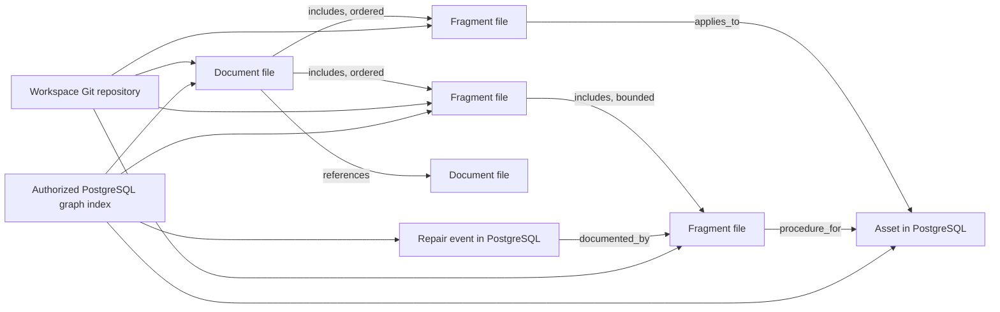

# Version 1 Markdown content graph delivery plan

Status: accepted product and architecture direction  
Decision date: 2026-10-02  
Baseline: 0.8.46  
Target: 1.0.0

## Version boundary

The Markdown content graph defines the version 1 architecture. The version
boundary is appropriate because it changes the canonical persistence contract
before TekDocs promises long-term 1.x compatibility.

The first implementation commit is not itself stable `1.0.0`. The `0.9.x`
series is the observable transition into version 1; `1.0.0` is the exit gate
after the repository, migration, recovery, authorization and release evidence
agree. Calling the first repository-backed build `1.0.0` would promise stability
while intentionally breaking and replacing persistence paths.

- `0.8.46` remains the current database-first baseline.
- `0.9.0` closes or explicitly transfers the remaining current-line work.
- `0.9.1` through `0.9.8` implement the version 1 storage and content graph.
- `1.0.0` freezes the supported Markdown profile, repository layout, migration
  path and application compatibility contract.

Version metadata is not changed by this planning decision. It changes with the
first completed and validated implementation checkpoint.

## Accepted architecture decisions

1. Authored documentation content and portable metadata are canonical Markdown
   files in Git.
2. TekDocs manages local Git repositories in persistent application storage by
   default. GitHub, GitLab and other remotes are optional later integrations.
3. Repository storage follows the raw-access boundary: one MSP repository and
   one repository per organization workspace. No canonical repository contains
   authored content or operational records from multiple organizations.
4. PostgreSQL remains canonical for authentication, authorization, workspace
   binding, review workflow, templates/enrollment control, attachments,
   publications, audit, integrations and operational records.
5. PostgreSQL stores disposable, rebuildable projections of Markdown content,
   metadata, links, backlinks, unresolved links and composition.
6. Documents and reusable fragments are first-class content nodes with stable
   UUIDs. Git history replaces database content revision history only after the
   affected feature has migrated.
7. A document explicitly owns its ordered outgoing `includes` edges. Backlinks
   describe incoming use and never decide what renders inline.
8. Narrative `[[wikilinks]]` are untyped references. Frontmatter relationships
   are typed. `tekdocs://entity/<uuid>` remains the stable reference to assets
   and other operational records.
9. Operational entities participate in the content graph without becoming
   Markdown-owned records. Asset and other record pages show authorized incoming
   documents, fragments, procedures, events and mentions.
10. Managed UI writes use a base commit/blob compare-and-swap. Conflicts are
    reviewable; last-write-wins is prohibited.
11. STATIC publications, publication decisions, retained artifacts and audit
    events remain append-only database/application evidence.
12. The supported backup contains PostgreSQL, repositories, managed files,
   retained artifacts and a manifest binding every workspace to an accepted
   commit.
13. Git owns authored knowledge, not the whole TekDocs interface. Workspace
    identity manifests and authored policies may be portable; assets, serial
    numbers, authoritative entity relationships, contracts, costs, invoices,
    permissions, approvals, audit events and other operational state remain in
    PostgreSQL or managed storage.

## Target content graph



Content inclusion is a directed acyclic graph with bounded depth and resolved
size. Cycles fail validation. A live include resolves at the accepted repository
head. A pinned include identifies a repository plus immutable commit/blob. An
independent copy is a new fragment with optional `derived_from` provenance.

## Managed repository layout

```text
repositories/
├── msp.git/
└── organizations/
    ├── <organization-uuid>.git/
    └── <organization-uuid>.git/
```

Each logical repository contains a portable working-tree shape:

```text
documents/
fragments/
.tekdocs/
├── repository.yml
├── workspace.yml
└── schema/
```

The MSP repository additionally contains a portable organization directory with
only stable organization/workspace UUIDs, display names, classifications and
repository identities. It does not aggregate organization documents, assets,
users, contracts, permissions or integration secrets. Each organization
repository repeats its own minimum self-describing identity manifest. PostgreSQL
remains authoritative for organization identity and all operational state; these
manifests are portable projections bound to stable UUIDs.

The inclusion rule is semantic, not based on which interface section displays a
record. Authored Workspace, Infrastructure, Relationship, Business or Governance
knowledge may live in Markdown. The mutable objects those documents describe do
not become Git records merely because the interface displays them beside the
documentation.

The runtime repositories live on a persistent volume, not an ephemeral
container layer. The backend or a focused repository worker may execute Git
operations; a separate Git server is not required.

TekDocs commits use a neutral service identity. The protected audit event maps
the authenticated user, request and resulting commit. Git author metadata is
not authorization or proof of approval.

## Backup and recovery strategy

Git updates the backup strategy but does not replace it. The supported encrypted
recovery set contains all components required to reconstruct one accepted
TekDocs state:

- PostgreSQL, including repository bindings, accepted heads, permissions,
  workflow, operational records, audit and publication state;
- a complete bundle of every MSP and organization repository, including objects
  not reachable from the current branch when they are retained dependencies;
- managed attachments, quarantine/clean storage and retained publication
  artifacts;
- required deployment-key material under the existing separate recovery-key
  custody contract; and
- a signed or authenticated manifest mapping every workspace and repository UUID
  to its accepted head, object inventory and component checksums.

Restore remains network-independent: it authenticates every component before
replacement, restores the database, repositories and managed files together,
verifies every accepted object, rebuilds derived indexes, and leaves writes
disabled when repository heads are missing, advanced or inconsistent. A GitHub
remote is an additional off-host replica of one workspace's authored knowledge,
not a complete backup: it does not contain PostgreSQL state, managed files,
permissions, audit, publications or recovery keys, and remote deletion or force
push can be replicated.

Operators should retain encrypted recovery sets off-host under the existing
retention policy even when every repository has a healthy remote. Customer-owned
repositories improve documentation custody and can help reconstruct content, but
they cannot independently restore a TekDocs installation.

## Version 1 delivery sequence

### `0.9.0` — current-line closeout and transfer

Goal: enter the architecture change with one understood baseline rather than
carrying two conflicting pre-1.0 plans.

- Complete the remaining invoice boundary: void-before-delivery, immutable
  credit notes and issue #33 accounting-handoff acceptance.
- Reconcile recurring-invoice issues #75/#76 against their existing runtime and
  recovery evidence; implement only reproduced gaps.
- Complete or explicitly transfer the non-document responsive work in
  #77–#81, #83–#84 and #86–#88.
- Transfer Documentation/Files acceptance from #82 into this plan rather than
  polishing a persistence-specific interface that is about to change.
- Reconcile #30–#32 with implemented structured topics, preflight and taxonomy
  evidence. Their remaining storage-specific work moves into `0.9.2`–`0.9.7`.
- Stop behavior-preserving extraction of the old document aggregate under #40
  where it no longer reduces migration risk. Preserve the focused modules
  already extracted and redirect the remaining document decomposition to
  storage adapters and repository services.
- Finish the controlled Networks legacy cleanup rehearsal and either apply the
  approved deletion or record the exact retained blocker.
- Shrink the parameterized-label exception register where wording is already
  decided; unresolved copy joins final interface acceptance.

Exit condition: every open 1.0 issue is closed, transferred to a named version
1 slice below, or explicitly deferred outside 1.0. No item remains open merely
because its GitHub description predates implemented evidence.

### `0.9.1` — local repository foundation

- Add repository binding, accepted-head and repository-health models with
  reviewed tenant/workspace boundaries and RLS classification.
- Add persistent repository storage and automatic initialization when an MSP or
  client workspace is created.
- Implement a repository service with locks, bounded subprocess/library calls,
  safe paths and value-minimized logs.
- Add commit attribution through audit without placing sensitive user values in
  commit messages.
- Extend setup, readiness and system status without asking for GitHub
  credentials.

Exit condition: repositories can be created, committed, inspected and restored
under the restricted runtime role without crossing a workspace boundary.

### `0.9.2` — Markdown profile, parser and rebuildable index

- Freeze frontmatter schema v1 for documents and fragments.
- Keep `markdown-it-py`; add bounded wikilink parsing and strict frontmatter
  validation.
- Add content-node, parsed-property, outgoing-link, backlink, unresolved-link
  and indexed-commit projections.
- Index accepted commits incrementally and support a deterministic full rebuild.
- Serve the last known good commit when a whole repository commit fails
  validation.
- Project taxonomy stable keys, topic schemas and publication-preflight findings
  through the new index.

Exit condition: deleting the derived content index and rebuilding from Git
produces the same authorized API projection and diagnostics.

### `0.9.3` — reusable fragment composition

- Add file-backed fragment identity and an ordered `includes` schema.
- Support live, pinned and independent-copy behavior.
- Reject cycles, excessive depth, excessive expanded size, ambiguous links and
  unauthorized cross-repository inclusion.
- Record where-used backlinks for every document and fragment.
- Add template source manifests backed by content IDs and Git objects while
  retaining database-authoritative enrollment and rollout decisions.

Exit condition: the current reusable-block behavior has a tested file-backed
equivalent, including nested composition, audience limits, exact pins, conflict
previews and rollback through a new commit.

### `0.9.4` — operational entity context and read paths

- Index narrative and typed links from content nodes to authorized operational
  entity UUIDs.
- Add record-page documentation projections for assets first, then other
  supported entity families through the shared relationship service.
- Distinguish exact-asset documentation from catalog-model or class-wide
  documentation.
- Show setup, enrollment, maintenance, troubleshooting, repair/event and generic
  mention relationships without exposing inaccessible content.
- Move document reading, search, health, database-like views and unresolved-link
  backlogs to the derived content graph.

Exit condition: an asset can show authorized incoming documentation and a
document can render authorized operational context without copying mutable asset
names or serial numbers into link identity.

### `0.9.5` — managed authoring and Git conflicts

- Write TekDocs-owned frontmatter fields with minimal source changes while
  preserving unknown fields and comments.
- Save body, metadata, relationships, includes, creates, moves and renames as
  logical local Git commits.
- Require base commit/blob compare-and-swap and return a three-way conflict for
  stale writes.
- Update known links during a rename and retain safe aliases.
- Reconcile commit success with outbox/index failures.
- Protect drafts and navigation across success, failure and conflict states.

Exit condition: concurrent UI and filesystem edits cannot silently lose
content, widen scope or leave a partially accepted repository commit.

### `0.9.6` — migration and coexistence

- Inventory existing production-shaped documents by composition complexity.
- Export existing IDs, content, metadata, taxonomy selections, keys and
  relationships into repositories in a deterministic migration commit.
- Support mixed legacy and Git-backed records only for the bounded migration
  window.
- Migrate simple documents first, then reusable blocks/templates after
  `0.9.3` parity.
- Provide dry-run counts, blockers, rollback and repeatability.
- Stop new legacy revisions only after the migrated route passes all write and
  publication paths.

Exit condition: a fresh fixture and an upgraded 0.8.46 fixture converge on the
same Git-backed content graph with no changed stable IDs or retained evidence.

### `0.9.7` — publications, files, export and recovery

- Freeze exact repository/commit/blob dependencies in STATIC manifests.
- Retain attachment custody outside Git while resolving Markdown references.
- Update editable exports, sanitized Git exports, templates, monitored sources,
  client listings and portal reads for the content graph.
- Extend encrypted backup/restore to repositories and add an accepted-head
  manifest tying repository state to PostgreSQL and retained files.
- Produce complete repository bundles rather than relying on working-tree copies
  or optional remotes, and prove a network-isolated restore.
- Rehearse interrupted commits, corrupt repositories, missing objects, storage
  exhaustion and database/repository mismatch recovery.

Exit condition: retained publications remain verifiable and append-only, and a
supported backup restores the exact accepted content graph without network or
GitHub access.

### `0.9.8` — version 1 acceptance

- Complete transferred responsive Documentation/Files work and issue #60
  interface review against the new authoring model.
- Run issue #39 technician and multi-installation pilots against the migrated
  system, not the superseded database authoring model.
- Run issue #38 commit-matched automated security review and disposition all
  Critical and untriaged High findings.
- Complete maintained-browser, keyboard, screen-reader, zoom, performance,
  DAST, production-image, upgrade, backup and recovery evidence.
- Reconcile Wiki, OpenAPI, product contract, roadmap, release notes and known
  risks.

Exit condition: a frozen candidate satisfies the 1.0 release record.

### `1.0.0` — contract freeze

`1.0.0` declares the supported repository/frontmatter schema, Git-backed
revision behavior, content graph, authorization boundaries, upgrade path and
recovery process stable for the 1.x line. It does not imply a commercial
release, hosted service, external certification or independent security audit.

## Current milestone reconciliation

| Current issue(s) | Disposition |
| --- | --- |
| #30 structured topics | Existing guided-authoring behavior is foundation; frontmatter/schema/index integration moves to `0.9.2`, authoring parity to `0.9.5`. |
| #31 publication preflight | Parser/link validation moves to `0.9.2`; Git-object dependency freezing and final publication evidence move to `0.9.7`. |
| #32 taxonomy governance | Taxonomy definitions remain database canonical; file selections and projections move to `0.9.2` and migration to `0.9.6`. |
| #33 invoice boundary | Priority closeout in `0.9.0`; it is independent of the document persistence change. |
| #38 security assurance | Final candidate work in `0.9.8`; focused security tests recur in every slice. |
| #39 pilots | Run in `0.9.8` against the final content model. Early usability checks may inform `0.9.3`–`0.9.5`. |
| #40 hotspot decomposition | Preserve completed seams; replace remaining old-document model extraction with repository, parser, graph-index and storage-adapter boundaries in `0.9.1`–`0.9.6`. |
| #60 interface review | Final review in `0.9.8`; do not complete the Documentation review against an interface scheduled for replacement. |
| #75–#76 recurring invoices | Evidence reconciliation and reproduced gaps in `0.9.0`. |
| #77–#81, #83–#84 | Close or explicitly transfer remaining non-document responsive acceptance in `0.9.0`. |
| #82 Documentation/Files | Superseded as an implementation plan by `0.9.4`–`0.9.8`; preserve its interaction and accessibility acceptance criteria. |
| #85 final responsive acceptance | Rebased onto `0.9.8`. |
| #86 collection APIs | Finish non-document summaries in `0.9.0`; document queries use the derived index in `0.9.4`. |
| #87 preferences | Close foundation evidence in `0.9.0`; content-graph views must consume the established preference contract where applicable. |
| #88 navigation/draft protection | Close shared foundation evidence in `0.9.0`; managed Git conflict and draft behavior extends it in `0.9.5`. |

## Existing backlog reconciliation

### Folded into version 1 architecture

| Backlog | Disposition |
| --- | --- |
| #42 conditional content profiles | Preserve existing audience behavior in `0.9.3`; multi-dimensional profiles remain a post-1.0 extension. |
| #43 hierarchical document keys | Preserve current key bindings in migration and publication; broader hierarchical scope is post-1.0. |
| #44 entity-linked diagrams/topology | The authorized content/entity graph foundation moves into `0.9.2`/`0.9.4`; additional diagram families remain post-1.0. |
| TD-BACKLOG-MSP-001 / #67 | First value slice after the graph foundation: build the client operational brief as a saved authorized content-graph view. Target 1.1 unless explicitly promoted without delaying 1.0. |
| TD-BACKLOG-MSP-002 / #68 | Define procedures as versioned documents/fragments and runs against exact Git objects. Target after 1.0 unless needed as a `0.9.8` pilot fixture. |
| TD-BACKLOG-MSP-003 / #69 | Build the portfolio overview from permission-filtered derived signals after 1.0. |
| TD-BACKLOG-MSP-004 / #70 | Reuse entity/content relationships for the business-service catalog after 1.0. |
| TD-BACKLOG-MSP-005 / #71 | Reconsider as Git-backed correction proposals or review branches after managed authoring is stable. |
| TD-BACKLOG-MSP-008 / #74 | Reuse exact Git revisions and STATIC packaging after `0.9.7`; remains post-1.0 unless explicitly promoted. |

### Retained after 1.0 without architectural duplication

- TD-BACKLOG-MSP-006/#72 flexible record layouts and
  TD-BACKLOG-MSP-007/#73 onboarding/offboarding remain application workflow
  work, not Markdown persistence work.
- #21 host-side production updates remains deployment work.
- #45–#58 remain optional external connector/system-of-action work. They may
  project links into the content graph but do not expand the 1.0 canonical
  storage scope.
- #61–#62 remain optional Mermaid authoring/catalog improvements.
- Payment allocation and quotes remain outside the 1.0 invoice boundary.
- Expanded conditional-content profiles, hierarchical key scopes, remote Git
  collaboration, pull-request authoring and bidirectional provider writeback
  remain post-1.0 unless separately promoted with bounded acceptance criteria.
- The accepted remote-Git follow-on is one optional connection and private
  repository per organization workspace. It supports local-only, MSP-owned and
  organization-owned custody; a single all-organizations remote is prohibited.

## First implementation slice

The first code slice after `0.9.0` closeout is `0.9.1` repository foundation,
not parser or UI work. Its acceptance fixture should create an MSP workspace and
two organization workspaces, prove separate repository roots and runtime ownership,
make deterministic commits, deny cross-workspace access, survive container
recreation, and restore from the supported encrypted backup without any remote
Git service.
