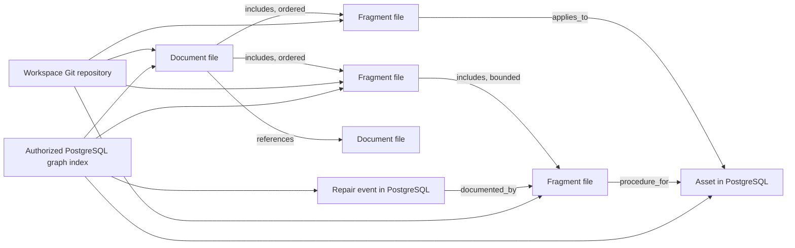

# Version 1 Markdown content graph delivery plan

Status: accepted direction with reconciled GitHub milestones; `0.9.0` baseline frozen
Decision date: 2026-10-02  
Architecture input baseline: 0.8.46
Current baseline: 0.9.0
Target: 1.0.0

## Version boundary

The Markdown content graph defines the version 1 architecture. The version
boundary is appropriate because it changes the canonical persistence contract
before TekDocs promises long-term 1.x compatibility.

The first implementation commit is not itself stable `1.0.0`. The `0.9.x`
series is the observable transition into version 1; `1.0.0` is the exit gate
after the repository, migration, recovery, authorization and release evidence
agree. Calling the first repository-backed build `1.0.0` would promise stability
while intentionally breaking and replacing persistence paths.

- `0.9.0` is the frozen database-first baseline.
- `0.9.0` closes or explicitly transfers the remaining current-line work.
- `0.9.1` through `0.9.8` implement the version 1 storage and content graph.
- `1.0.0` freezes the supported Markdown profile, repository layout, migration
  path and application compatibility contract.

Version metadata now identifies the frozen `0.9.0` baseline. Later metadata
changes only with each completed and validated implementation checkpoint.

## Accepted architecture decisions

1. Authored documentation content and portable metadata are canonical Markdown
   files in Git.
2. TekDocs manages local Git repositories in persistent application storage by
   default. GitHub, GitLab and other remotes are optional later integrations.
3. Repository storage follows the raw-access boundary: one MSP repository and
   one repository per organization workspace. No canonical repository contains
   authored content or operational records from multiple organizations.
4. PostgreSQL remains canonical for authentication, authorization, workspace
   binding, review workflow, templates/enrollment control, attachments,
   publications, audit, integrations and operational records.
5. PostgreSQL stores disposable, rebuildable projections of Markdown content,
   metadata, links, backlinks, unresolved links and composition.
6. Documents and reusable fragments are first-class content nodes with stable
   UUIDs. Git history replaces database content revision history only after the
   affected feature has migrated.
7. A document explicitly owns its ordered outgoing `includes` edges. Backlinks
   describe incoming use and never decide what renders inline.
8. Narrative `[[wikilinks]]` are untyped references. Frontmatter relationships
   are typed. `tekdocs://entity/<uuid>` remains the stable reference to assets
   and other operational records.
9. Operational entities participate in the content graph without becoming
   Markdown-owned records. Asset and other record pages show authorized incoming
   documents, fragments, procedures, events and mentions.
10. Managed UI writes use a base commit/blob compare-and-swap. Conflicts are
    reviewable; last-write-wins is prohibited.
11. STATIC publications, publication decisions, retained artifacts and audit
    events remain append-only database/application evidence.
12. The supported backup contains PostgreSQL, repositories, managed files,
   retained artifacts and a manifest binding every workspace to an accepted
   commit.
13. Git owns authored knowledge, not the whole TekDocs interface. Workspace
    identity manifests and authored policies may be portable; assets, serial
    numbers, authoritative entity relationships, contracts, costs, invoices,
    permissions, approvals, audit events and other operational state remain in
    PostgreSQL or managed storage.

## Target content graph



Content inclusion is a directed acyclic graph with bounded depth and resolved
size. Cycles fail validation. A live include resolves at the accepted repository
head. A pinned include identifies a repository plus immutable commit/blob. An
independent copy is a new fragment with optional `derived_from` provenance.

## Managed repository layout

```text
repositories/
├── msp.git/
└── organizations/
    ├── <organization-uuid>.git/
    └── <organization-uuid>.git/
```

Each logical repository contains a portable working-tree shape:

```text
documents/
fragments/
.tekdocs/
├── repository.yml
├── workspace.yml
└── schema/
```

The MSP repository additionally contains a portable organization directory with
only stable organization/workspace UUIDs, display names, classifications and
repository identities. It does not aggregate organization documents, assets,
users, contracts, permissions or integration secrets. Each organization
repository repeats its own minimum self-describing identity manifest. PostgreSQL
remains authoritative for organization identity and all operational state; these
manifests are portable projections bound to stable UUIDs.

The inclusion rule is semantic, not based on which interface section displays a
record. Authored Workspace, Infrastructure, Relationship, Business or Governance
knowledge may live in Markdown. The mutable objects those documents describe do
not become Git records merely because the interface displays them beside the
documentation.

The runtime repositories live on a persistent volume, not an ephemeral
container layer. The backend or a focused repository worker may execute Git
operations; a separate Git server is not required.

TekDocs commits use a neutral service identity. The protected audit event maps
the authenticated user, request and resulting commit. Git author metadata is
not authorization or proof of approval.

## Backup and recovery strategy

Git updates the backup strategy but does not replace it. The supported encrypted
recovery set contains all components required to reconstruct one accepted
TekDocs state:

- PostgreSQL, including repository bindings, accepted heads, permissions,
  workflow, operational records, audit and publication state;
- a complete bundle of every MSP and organization repository, including objects
  not reachable from the current branch when they are retained dependencies;
- managed attachments, quarantine/clean storage and retained publication
  artifacts;
- required deployment-key material under the existing separate recovery-key
  custody contract; and
- a signed or authenticated manifest mapping every workspace and repository UUID
  to its accepted head, object inventory and component checksums.

Restore remains network-independent: it authenticates every component before
replacement, restores the database, repositories and managed files together,
verifies every accepted object, rebuilds derived indexes, and leaves writes
disabled when repository heads are missing, advanced or inconsistent. A GitHub
remote is an additional off-host replica of one workspace's authored knowledge,
not a complete backup: it does not contain PostgreSQL state, managed files,
permissions, audit, publications or recovery keys, and remote deletion or force
push can be replicated.

Operators should retain encrypted recovery sets off-host under the existing
retention policy even when every repository has a healthy remote. Customer-owned
repositories improve documentation custody and can help reconstruct content, but
they cannot independently restore a TekDocs installation.

## Version 1 delivery sequence

The evidence-backed `0.9.0` disposition and issue-ready `0.9.1` work breakdown
are maintained in
[`v1-transition-work-package.md`](v1-transition-work-package.md). That record is
the execution checklist; this document remains the architecture and release
sequence authority. GitHub issues #92–#108 now provide the corresponding
implementation, acceptance, optional-remote and final-freeze owners.

### `0.9.0` — current-line closeout and transfer

Goal: enter the architecture change with one understood baseline rather than
carrying two conflicting pre-1.0 plans.

- Retain and close out the implemented invoice boundary: void-before-delivery,
  immutable credit notes and issue #33 accounting-handoff acceptance.
- Reconcile recurring-invoice issues #75/#76 against their existing runtime and
  recovery evidence; implement only reproduced gaps.
- Complete or explicitly transfer the non-document responsive work in
  #77–#81, #83–#84 and #86–#88.
- Transfer Documentation/Files acceptance from #82 into this plan rather than
  polishing a persistence-specific interface that is about to change.
- Reconcile #30–#32 with implemented structured topics, preflight and taxonomy
  evidence. Their remaining storage-specific work moves into `0.9.2`–`0.9.7`.
- Stop behavior-preserving extraction of the old document aggregate under #40
  where it no longer reduces migration risk. Preserve the focused modules
  already extracted and redirect the remaining document decomposition to
  storage adapters and repository services.
- The controlled Networks legacy cleanup rehearsal is complete. Lossless
  projections pass exact-workspace, upgrade and clean recovery evidence; the
  exact retained disposition requires a separate deprecation and
  operator-approved migration before any compatibility row can be deleted.
- Shrink the parameterized-label exception register where wording is already
  decided; unresolved copy joins final interface acceptance.

Exit condition: every open 1.0 issue is closed, transferred to a named version
1 slice below, or explicitly deferred outside 1.0. No item remains open merely
because its GitHub description predates implemented evidence.

### `0.9.1` — local repository foundation

- Add repository binding, accepted-head and repository-health models with
  reviewed tenant/workspace boundaries and RLS classification.
- Add persistent repository storage and automatic initialization when an MSP or
  client workspace is created.
- Implement a repository service with locks, bounded subprocess/library calls,
  safe paths and value-minimized logs.
- Add commit attribution through audit without placing sensitive user values in
  commit messages.
- Extend setup, readiness and system status without asking for GitHub
  credentials.

Exit condition: repositories can be created, committed, inspected and restored
under the restricted runtime role without crossing a workspace boundary.

### `0.9.2` — Markdown profile, parser and rebuildable index

- Freeze frontmatter schema v1 for documents and fragments.
- Keep `markdown-it-py`; add bounded wikilink parsing and strict frontmatter
  validation.
- Add content-node, parsed-property, outgoing-link, backlink, unresolved-link
  and indexed-commit projections.
- Index accepted commits incrementally and support a deterministic full rebuild.
- Serve the last known good commit when a whole repository commit fails
  validation.
- Project taxonomy stable keys, topic schemas and publication-preflight findings
  through the new index.

Exit condition: deleting the derived content index and rebuilding from Git
produces the same authorized API projection and diagnostics.

### `0.9.3` — reusable fragment composition

- Add file-backed fragment identity and an ordered `includes` schema.
- Support live, pinned and independent-copy behavior.
- Reject cycles, excessive depth, excessive expanded size, ambiguous links and
  unauthorized cross-repository inclusion.
- Record where-used backlinks for every document and fragment.
- Add template source manifests backed by content IDs and Git objects while
  retaining database-authoritative enrollment and rollout decisions.

Exit condition: the current reusable-block behavior has a tested file-backed
equivalent, including nested composition, audience limits, exact pins, conflict
previews and rollback through a new commit.

### `0.9.4` — operational entity context and read paths

- Index narrative and typed links from content nodes to authorized operational
  entity UUIDs.
- Add record-page documentation projections for assets first, then other
  supported entity families through the shared relationship service.
- Distinguish exact-asset documentation from catalog-model or class-wide
  documentation.
- Show setup, enrollment, maintenance, troubleshooting, repair/event and generic
  mention relationships without exposing inaccessible content.
- Move document reading, search, health, database-like views and unresolved-link
  backlogs to the derived content graph.

Exit condition: an asset can show authorized incoming documentation and a
document can render authorized operational context without copying mutable asset
names or serial numbers into link identity.

### `0.9.5` — managed authoring and Git conflicts

- Write TekDocs-owned frontmatter fields with minimal source changes while
  preserving unknown fields and comments.
- Save body, metadata, relationships, includes, creates, moves and renames as
  logical local Git commits.
- Require base commit/blob compare-and-swap and return a three-way conflict for
  stale writes.
- Update known links during a rename and retain safe aliases.
- Reconcile commit success with outbox/index failures.
- Protect drafts and navigation across success, failure and conflict states.

Exit condition: concurrent UI and filesystem edits cannot silently lose
content, widen scope or leave a partially accepted repository commit.

### `0.9.6` — migration and coexistence

The first migration gate is a read-only, exact-workspace inventory. Run
`docker compose run --rm migrate python manage.py inventory_document_migration --workspace <workspace-uuid>`
against a controlled copy of the database. Its sorted JSON lists each legacy
document ID, placement count, simple-shape candidates, and explicit deferral
reasons; it does not export bodies, modify Git, or switch read/write authority.
Repository-wide readiness is reported separately. Repeat the command and
compare output before applying any import. A simple-shape candidate is **not**
yet approved for cutover: metadata mapping, parity, and rollback remain below.

For one `simple_candidate`, run
`docker compose run --rm migrate python manage.py preview_document_migration --workspace <workspace-uuid> --document <document-uuid>`.
This first-wave shape now includes one or more ordered, document-owned, live,
shared sections, including bounded nested sections. Parent-child order is
preserved as nested includes; cycles, missing parents and excessive depth are
deferred. A live cross-document leaf may be referenced only when its source
document and fragment are already indexed in the same workspace repository,
the fragment is a leaf, and its Markdown matches the current legacy block
revision exactly. A new pinned cross-document leaf uses the current accepted
commit when its indexed fragment matches the selected legacy revision. Otherwise,
the exporter searches at most 32 first-parent commits of that accepted head,
newest first and with a 64 MiB aggregate history-read limit. It pins the first
retained, verified same-repository snapshot whose leaf Markdown matches the
selected revision and whose source document reaches that leaf through live
includes. An already copied target retains its exact pin across later source
edits, provided the snapshot remains available. Pinned owned sections, non-leaf
references, pins with no match inside that bound, and cross-workspace reuse
remain deferred. The target import writes no second copy of a referenced fragment.
The preview deterministically builds `docs/<document-uuid>.md` and one
`fragments/<block-uuid>.md` per section, retaining their IDs, order and portable
category, collection, legacy tags and valid taxonomy selections. Taxonomy
frontmatter uses stable vocabulary and term keys; selected global terms must be
active in the current version, and client-local terms must be active, enabled
and owned by the exact organization. Stale, retired, archived, ambiguous or
out-of-scope selections remain deferred with `taxonomy_mapping_required`.
An outgoing legacy `references` link from the document to an active entity in
the exact same workspace becomes a neutral `entity_links` `mention` entry with
the target's stable entity UUID when its entity type has a permission-filtered
repository read projection. This includes assets, people, sites and network
records, but never infers setup, enrollment or troubleshooting intent.
Incoming links, other link types, unsupported entity types, archived targets
and foreign-workspace targets remain deferred with
`relationship_mapping_required`.
It validates the combined repository candidate and requires the composed
Markdown to equal the legacy resolved Markdown exactly. Schema-v1 structured
topics are eligible when that composed Markdown contains each required topic
section once; the root file preserves the topic type/version while included
fragments carry the sections. Missing or duplicate sections block preview.
The JSON contains copied paths, byte counts, SHA-256 digests, referenced-source
digests, exact pinned commits when present, ordered source revisions and
accepted base commit, not document bodies. It does **not** commit or change
content authority. Unknown topic versions and complex/retained relationships
stay deferred; topic copy does not imply publication parity or cutover.
Ordinary document attachments remain in the managed file store, not Git. Their
stable links are checked against active, clean records owned by the exact
document; preview verifies stored bytes against size and checksum and binds
attachment metadata into the import plan. Repository detail reads resolve the
same authorized download links for copied documents. Missing, archived or
corrupt references block the copy. Primary-file version chains remain deferred
until file/publication parity is addressed in `0.9.7`.
Field-key bindings are copied as a bounded `key_bindings` name-to-Entity-ID
mapping in document frontmatter; resolved values and sensitive fields never go
to Git. Preview requires active, exact-workspace bindings and addressable field
paths, binds binding identities to its plan, and preserves the literal key
expressions in Markdown. During coexistence, repository reads resolve a key
only when the portable map still matches live legacy bindings, using the
existing per-reader field authorization. Archived bindings become unresolved.
Content-expanding keys remain deferred until their composition semantics can
be made portable; inconsistent or foreign bindings are rejected, in addition
to the existing database scope guard.

An operator may copy one eligible, unchanged preview with
`python manage.py import_document_migration --workspace <workspace-uuid> --document <document-uuid> --base-commit <preview-base> --plan-sha256 <preview-plan-sha256> --actor <tenant-operator-uuid> --apply`
in the migration container. The plan fingerprint binds every proposed file
digest, ordered source revisions, IDs and exact repository base. The Git commit uses
compare-and-swap, is audited, and is followed by indexing and parity checks.
An interrupted index can be retried with the same command without another Git
commit. `index_pending`, `verification_pending` and `source_changed` are not
cutover-ready states. Legacy data, editor, reads and publications remain
authoritative throughout.

To undo an unchanged copy, run
`python manage.py rollback_document_migration --workspace <workspace-uuid> --document <document-uuid> --expected-commit <current-accepted-commit> --actor <tenant-operator-uuid> --apply`.
Rollback refuses changed files, a stale repository base, or incoming links
and inclusions from other content; it removes only files copied for that
document in a **new**
audited Git commit and reindexes. Historical Git commits and all legacy
revisions remain intact. A rollback after external edits needs an explicit
operator reconciliation rather than an automatic overwrite.

During this bounded coexistence window, staff with document-view permission
can inspect `GET /api/v1/documents/<entity-id>/migration-status` or the exact
organization-workspace equivalent. The read-only response compares the current
legacy revision with the indexed document/fragment copy and reports
`legacy_only`, `index_pending`, `in_sync`, `diverged`, `partial_copy`, or an
unsupported shape. It never routes reads or writes to Git: `legacy_authoritative`
is true and `cutover_ready` is false in every state. This is deliberately a
derived status, not a persisted authority marker. `in_sync` also requires the
indexed title, Markdown, topic, taxonomies and portable properties to match
the parsed repository source. Ordered include edges must retain their targets,
audience, resolution mode and live source digest; stale metadata or edges are
`diverged` until reindexing. Indexed wikilinks also preserve ordered target IDs,
labels, fragments and resolved backlink pointers, leaving unknown targets
unresolved. Composed operational-entity links must agree with indexed rows,
while the document root is compared with the export's independently resolved
link list so a jointly stale composition and row set cannot pass parity.
`handoff_blockers` makes the
copy-parity gate and the still-unimplemented repository read/write and
publication gates explicit, including when the copy is `in_sync`; it is not a
promotion command. Promotion must wait for
write, review, key, template, attachment and publication parity.
For an `in_sync` copy, `read_projection_state` separately exercises the
permission-scoped repository detail route and compares its title and composed
Markdown, rendered HTML (including reader-scoped key, attachment and entity
resolution), and viewer-visible outgoing legacy `references` links with the
legacy read. A mismatch is a handoff blocker; a match does
not establish full document-detail, editor, key, or publication parity.

Next, expand the exporter and parity checks to cross-workspace reuse and
remaining legacy metadata and relationship types, then add an explicit per-document authority transition
only after every relevant read and write path can use the Git graph. These
deferred shapes do not prevent closing the bounded `0.9.6` copy release, but
must remain visible in inventory and cannot be treated as migrated. Retain
legacy revisions and all operational evidence for rollback; rollback must be
a new Git commit or a controlled reversal of authority, never a history
rewrite. Do not retire the legacy editor until key, taxonomy, relationship,
template, attachment and publication paths pass on both fresh and upgraded
fixtures.

- Inventory existing production-shaped documents by composition complexity.
- Export existing IDs, content, metadata, taxonomy selections, keys and
  relationships into repositories in a deterministic migration commit.
- Support mixed legacy and Git-backed records only for the bounded migration
  window.
- Migrate simple documents first, then reusable blocks/templates after
  `0.9.3` parity.
- Provide dry-run counts, blockers, rollback and repeatability.
- Stop new legacy revisions only after the migrated route passes all write and
  publication paths.

`0.9.6` exit condition: fresh and upgraded `0.8.46` fixtures demonstrate the
same deterministic first-wave export for eligible documents, preserve stable
IDs and retained legacy evidence, and reject unsupported records with explicit
reasons. Preview, import, retry, parity status and guarded rollback pass with
exact-workspace authorization; neither legacy read nor write authority moves.
Full supported-document convergence and legacy-write retirement remain later
gates after file, template, review, key, publication and recovery parity.

### `0.9.7` — publications, files, export and recovery

- Freeze exact repository/commit/blob dependencies in STATIC manifests.
- Retain attachment custody outside Git while resolving Markdown references.
- Update editable exports, sanitized Git exports, templates, monitored sources,
  client listings and portal reads for the content graph.
- Sanitized Git export now accepts an optional complete, exact accepted and
  indexed repository Markdown snapshot for one Workspace. It removes known
  credential references, key bindings and managed attachment links, bounds
  source and ZIP size, and labels the output snapshot-only. This is export
  parity groundwork, not an editable export, Git-history transfer or backup;
  The browser can now select that repository snapshot with or without legacy
  records and identifies saved repository bundles; remaining format parity
  stays open.
- The existing sanitized-export POST now translates its public document and
  publication ID fields to the export service instead of failing before bundle
  creation. Endpoint tests verify document and repository-only selections and
  reject cross-client document selection. ZIP semantics and remaining parity
  work are unchanged.
- A sanitized Git export refuses selected STATIC publications that froze field-
  key values; those values occur in both signed metadata and canonical Markdown
  and cannot be safely removed without falsifying the publication evidence.
  Endpoint tests retain ordinary publication selection and exact-client denial.
- The staff repository editor can download the exact loaded Markdown file,
  including portable frontmatter, for one document or fragment. It labels the
  accepted Git revision and excludes unsaved edits. This is a per-file editable
  source export, not a complete dependency bundle, Git-history transfer or backup.
- Staff can also download a bounded, deterministic ZIP of every current Markdown
  file in one accepted-and-indexed Workspace commit plus reachable historical
  include, template-source, and copy-provenance Markdown. Dependencies are
  traversed transitively in their historical commit context. It retains exact
  source bytes and a commit/path/hash/role manifest. It is unsanitized and omits
  attachments, database records and Git history; it is not a complete dependency
  bundle or backup. Index lag and unavailable source fail closed.
- An offline verifier checks a downloaded source ZIP's v3 manifest, exact listed
  Markdown identities and checksums, safe paths, bounded entries and unexpected
  files. It also recomputes transitive include/template/copy dependencies and
  refuses omitted, unreferenced or mislabelled historical sources. It proves
  internal consistency only: the manifest is not signed against
  Git, and this neither imports content nor verifies attachments or backup state.
- Extend encrypted backup/restore to repositories and add an accepted-head
  manifest tying repository state to PostgreSQL and retained files.
- Produce complete repository bundles rather than relying on working-tree copies
  or optional remotes, and prove a network-isolated restore.
- Rehearse interrupted commits, corrupt repositories, missing objects, storage
  exhaustion and database/repository mismatch recovery.
- Repository backup and offline bundle validation now run a full strict Git
  object check, and final database/repository verification repeats it. Missing
  file objects fail the backup or final verification even when the retained
  commit itself still exists. Focused Docker tests cover both damaged states;
  the production fault-rehearsal matrix above remains open. A production-shaped
  rehearsal now also advances one isolated Git head away from PostgreSQL's
  accepted commit, proves backup refusal without a partial recovery set, repairs
  custody through a one-off maintenance container, and requires a healthy
  backend and network-isolated restore. A bounded encrypted-artifact write
  rehearsal now also checks failure cleanup, backend health, and a successful
  backup retry before that restore; actual host-disk exhaustion remains open.
- Docker-backed fault injection now covers repository-bundle creation and final
  archive writes running out of space. Both refuse publication, remove temporary
  recovery references/files, preserve the accepted head, and permit a verified
  retry. The supported backup is separately rehearsed with a process file-size
  limit during encrypted PostgreSQL capture; it leaves no final or partial set,
  resumes to a healthy backend, and permits the normal verified retry. This
  simulates a bounded write failure, not whole-host filesystem exhaustion.
- The network-isolated restore rehearsal now retains an authored document and
  reusable fragment with a pinned historical include before backup. The
  restored stack must recover the current fragment, original pinned source,
  indexed composition, and both Git revisions; repository manifests alone
  no longer satisfy this evidence. This is local recovery evidence, not an
  authority handoff or production restore acceptance.
- The same rehearsal now retains a client-owned Markdown document in its
  organization's separate repository while the MSP repository retains the
  portable organization directory entry. After restore it checks the exact
  directory-to-repository mapping, client content, and absence of each
  Workspace's document identity from the other repository. This proves the
  local storage partition, not authorization or hosted Git integration.

Exit condition: retained publications remain verifiable and append-only, and a
supported backup restores the exact accepted content graph without network or
GitHub access.

First foundation (implemented, not the exit condition): an internal source
freezer re-reads the exact accepted Git snapshot, recomputes the audience
composition, compares it with the indexed projection, and records root and
included fragment commit/path/blob identities. Missing historical objects,
index lag and projection drift fail closed. A second foundation holds the
accepted Git head and database row stable through evidence retention, including
inside request transactions. A third foundation signs the exact source proof
and composed Markdown into a separate append-only, exact-Workspace record that
verifies without live Git. It is not a distributable STATIC publication: the
legacy publisher remains authoritative, and approval, final artifacts, file/export/
portal parity and repository-inclusive recovery remain in this milestone.
An additional internal readiness gate blocks retention when the selected
audience composition is empty, has required-topic gaps, or contains dynamic
files, keys, entity cards, images, unsupported TekDocs links or Mermaid output
that has not been frozen. The signed manifest records only versioned,
value-free finding codes; this does not substitute for artifact packaging.
Subsequent internal evidence now retains managed attachment bytes, entity
display cards, frozen field-key values, sanitized HTML and a private PDF
projection. These verify offline against signed inputs but are not yet
approved or distributed as STATIC publications. Historical artifact integrity
is based on signed retained bytes and checksums; current-renderer reproduction
is a diagnostic rather than an upgrade-sensitive validity gate. A staff-only,
MFA-gated API now retains and lists scoped evidence summaries for review; it
does not approve publications or distribute artifacts. A separate approver-only
read verifies the retained evidence before returning exact canonical Markdown;
it does not expose frozen key values or downloadable files.
The internal path now requires independent evidence review, package creation,
authorization, and a signed repository STATIC record before an MFA-enabled
approver can release it. Release and withdrawal are append-only exact-Workspace
decisions. A replacement must be independently signed and authorized and name
the one active predecessor for the same document and audience; PostgreSQL
serializes the decision and the predecessor remains verifiable as superseded
history even if the replacement is withdrawn. This is not client delivery:
repository portal routes, notifications, and legacy authority handoff remain
separate exit gates.
A separate append-only client-delivery authorization is the next gate after an
active internal release. It rechecks the signed retained chain and current
client-visible entity references; it is ineffective after withdrawal,
supersession, artifact corruption, or a reference-visibility change. It does
not itself add a portal read or download path.
The first client delivery path adds bounded, exact-organization portal API
listing and detail reads plus a checked PDF download. Its attachment extension
lists signed retained-file descriptors in detail and permits only exact-evidence
bytes through a forced, private download after a second returned-byte check.
Every request rechecks current delivery authorization, signed retained artifacts,
and referenced entity visibility; it does not re-render live Git. The existing
portal UI, notifications, exports, and authority handoff remain separate work.
The client portal now has a separate New publications view for the authorized
repository list, retained HTML, PDF and attachment links. It preserves direct
URLs, paging, empty/retry states and server-side revocation. Legacy Documents
stays on its existing path until the authority handoff is independently proven;
notification, export and recovery parity were separate work at this point.
Repository delivery authorization now queues a value-minimized publication notice
for the exact organization. Supersession and withdrawal queue a generic
access-change notice only when the predecessor had client-delivery authorization.
The portal inbox opens an available repository publication directly; inbox and
email delivery recheck current authorization and suppress stale availability
after access is revoked. These internal notification topics are not outbound
webhook subscriptions. Export parity, repository-inclusive recovery and the
legacy authority handoff remain open.

### `0.9.8` — version 1 acceptance

- Complete transferred responsive Documentation/Files work and issue #60
  interface review against the new authoring model.
- Run issue #39 technician and multi-installation pilots against the migrated
  system, not the superseded database authoring model.
- Run issue #38 commit-matched automated security review and disposition all
  Critical and untriaged High findings.
- Complete maintained-browser, keyboard, screen-reader, zoom, performance,
  DAST, production-image, upgrade, backup and recovery evidence.
- Reconcile Wiki, OpenAPI, product contract, roadmap, release notes and known
  risks.

Exit condition: a frozen candidate satisfies the 1.0 release record.

### `1.0.0` — contract freeze

`1.0.0` declares the supported repository/frontmatter schema, Git-backed
revision behavior, content graph, authorization boundaries, upgrade path and
recovery process stable for the 1.x line. It does not imply a commercial
release, hosted service, external certification or independent security audit.

## Current milestone reconciliation

| Current issue(s) | Disposition |
| --- | --- |
| #30 structured topics | Existing guided-authoring behavior is foundation; frontmatter/schema/index integration moves to `0.9.2`, authoring parity to `0.9.5`. |
| #31 publication preflight | Parser/link validation moves to `0.9.2`; Git-object dependency freezing and final publication evidence move to `0.9.7`. |
| #32 taxonomy governance | Taxonomy definitions remain database canonical; file selections and projections move to `0.9.2` and migration to `0.9.6`. |
| #33 invoice boundary | Complete in `0.9.0`: privileged void-before-delivery, separately numbered immutable credit notes, supported recovery and the composed repository gate. It is independent of the document persistence change. |
| #38 security assurance | Final candidate work in `0.9.8`; focused security tests recur in every slice. |
| #39 pilots | Run in `0.9.8` against the final content model. Early usability checks may inform `0.9.3`–`0.9.5`. |
| #40 hotspot decomposition | Preserve completed seams; replace remaining old-document model extraction with repository, parser, graph-index and storage-adapter boundaries in `0.9.1`–`0.9.6`. |
| #60 interface review | Final review in `0.9.8`; do not complete the Documentation review against an interface scheduled for replacement. |
| #75–#76 recurring invoices | Evidence reconciliation and reproduced gaps in `0.9.0`. |
| #77–#81, #83–#84 | Close or explicitly transfer remaining non-document responsive acceptance in `0.9.0`. |
| #82 Documentation/Files | Superseded as an implementation plan by `0.9.4`–`0.9.8`; preserve its interaction and accessibility acceptance criteria. |
| #85 final responsive acceptance | Rebased onto `0.9.8`. |
| #86 collection APIs | Finish non-document summaries in `0.9.0`; document queries use the derived index in `0.9.4`. |
| #87 preferences | Close foundation evidence in `0.9.0`; content-graph views must consume the established preference contract where applicable. |
| #88 navigation/draft protection | Close shared foundation evidence in `0.9.0`; managed Git conflict and draft behavior extends it in `0.9.5`. |

## Existing backlog reconciliation

### Folded into version 1 architecture

| Backlog | Disposition |
| --- | --- |
| #42 conditional content profiles | Preserve existing audience behavior in `0.9.3`; multi-dimensional profiles remain a post-1.0 extension. |
| #43 hierarchical document keys | Preserve current key bindings in migration and publication; broader hierarchical scope is post-1.0. |
| #44 entity-linked diagrams/topology | The authorized content/entity graph foundation moves into `0.9.2`/`0.9.4`; additional diagram families remain post-1.0. |
| TD-BACKLOG-MSP-001 / #67 | First value slice after the graph foundation: build the client operational brief as a saved authorized content-graph view. Target 1.1 unless explicitly promoted without delaying 1.0. |
| TD-BACKLOG-MSP-002 / #68 | Define procedures as versioned documents/fragments and runs against exact Git objects. Target after 1.0 unless needed as a `0.9.8` pilot fixture. |
| TD-BACKLOG-MSP-003 / #69 | Build the portfolio overview from permission-filtered derived signals after 1.0. |
| TD-BACKLOG-MSP-004 / #70 | Reuse entity/content relationships for the business-service catalog after 1.0. |
| TD-BACKLOG-MSP-005 / #71 | Reconsider as Git-backed correction proposals or review branches after managed authoring is stable. |
| TD-BACKLOG-MSP-008 / #74 | Reuse exact Git revisions and STATIC packaging after `0.9.7`; remains post-1.0 unless explicitly promoted. |

### Retained after 1.0 without architectural duplication

- TD-BACKLOG-MSP-006/#72 flexible record layouts and
  TD-BACKLOG-MSP-007/#73 onboarding/offboarding remain application workflow
  work, not Markdown persistence work.
- #21 host-side production updates remains deployment work.
- #45–#58 remain optional external connector/system-of-action work. They may
  project links into the content graph but do not expand the 1.0 canonical
  storage scope.
- #61–#62 remain optional Mermaid authoring/catalog improvements.
- Payment allocation and quotes remain outside the 1.0 invoice boundary.
- Expanded conditional-content profiles, hierarchical key scopes, remote Git
  collaboration, pull-request authoring and bidirectional provider writeback
  remain post-1.0 unless separately promoted with bounded acceptance criteria.
- The accepted remote-Git follow-on in #107 is one optional connection and private
  repository per organization workspace. It supports local-only, MSP-owned and
  organization-owned custody; a single all-organizations remote is prohibited.

## First implementation slice

The first code slice after `0.9.0` closeout is `0.9.1` repository foundation,
not parser or UI work. Its acceptance fixture should create an MSP workspace and
two organization workspaces, prove separate repository roots and runtime ownership,
make deterministic commits, deny cross-workspace access, survive container
recreation, and restore from the supported encrypted backup without any remote
Git service.
